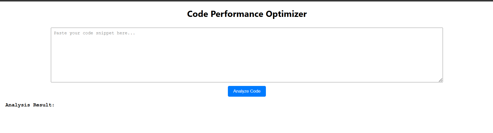
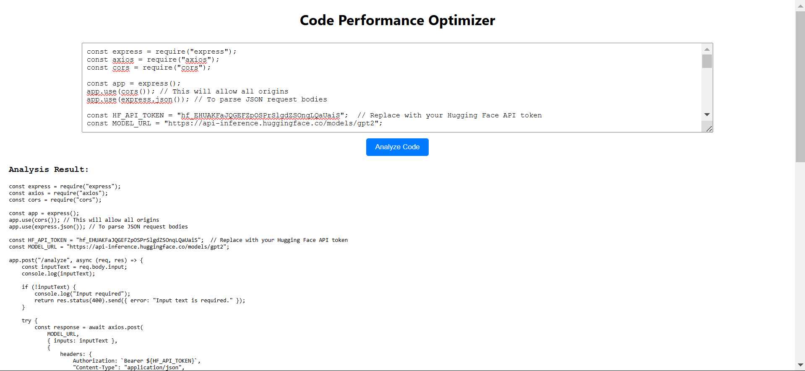

# Code Performance Optimizer

This project is a **Code Performance Optimizer** that analyzes code snippets using a machine learning model hosted on Hugging Face. It includes both a **backend** built with Express.js to interact with the Hugging Face API and a **frontend** built with React.js for the user interface.

## Table of Contents
1. [Installation](#installation)
2. [How to Run the Project](#how-to-run-the-project)
3. [Design Choices](#design-choices)
4. [Assumptions and Limitations](#assumptions-and-limitations)

---

## Installation

### Backend:
1. Enter the valid hugging face api key in server.js file
2. Ensure you have [Node.js](https://nodejs.org/) installed on your system.
3. Navigate to the backend directory and install dependencies:
   ```bash
   cd backend
   npm install
   ```

### Frontend:
1. Ensure you have [Node.js](https://nodejs.org/) and [npm](https://www.npmjs.com/) installed.
2. Navigate to the frontend directory and install dependencies:
   ```bash
   cd frontend
   npm install
   ```

---

## How to Run the Project

1. **Start the Backend Server:**

   Open a terminal, navigate to the backend folder, and run:
   ```bash
   cd backend
   node server.js
   ```

   This will start the backend server on `http://localhost:3000`. The backend is responsible for interacting with the Hugging Face API to perform code analysis.

2. **Start the Frontend React Application:**

   Open another terminal, navigate to the frontend folder, and run:
   ```bash
   cd frontend
   npm start
   ```

   This will start the frontend React application on `http://localhost:3001` (or any available port, if 3001 is already in use). The frontend allows the user to input code snippets and sends them to the backend for analysis.

---

## Design Choices

### 1. **Backend:**
   - **Framework:** The backend is built using Express.js, a minimal and flexible Node.js web application framework. Express allows easy routing, middleware handling, and HTTP request/response management.
   - **API Integration:** The backend sends requests to the Hugging Face API to interact with the pre-trained model (in this case, GPT-2). Axios is used to make HTTP requests.
   - **CORS Handling:** CORS middleware is used to allow cross-origin requests from the frontend (React app) to the backend, which is essential when the frontend and backend are served on different ports during development.

### 2. **Frontend:**
   - **Framework:** React.js is used for the frontend to create a dynamic and responsive user interface.
   - **State Management:** React's built-in `useState` hook is used to manage states for the code snippet input, result, and loading status.
   - **Code Submission:** The code snippet is submitted to the backend via a `POST` request, and the result is displayed once the backend responds with the generated text.

---

## Assumptions and Limitations

### Assumptions:
- **Valid Code Input:** The user is assumed to input valid code snippets (e.g., JavaScript, Python, etc.) into the provided textarea. No additional validation is performed on the input.
- **Internet Connection:** The backend relies on Hugging Face's external API, so an active internet connection is required for the application to function.
- **Model Availability:** The backend relies on a Hugging Face model for code analysis, and the model is assumed to be available and responsive. Any downtime or delay in model loading from Hugging Face will affect the performance of the application.

### Limitations:
- **Model Response Time:** The Hugging Face model may take time to load or may not respond instantly. This could cause delays, especially for larger models or during periods of high traffic.
- **API Token Limitations:** The Hugging Face API may have rate limits or usage restrictions for free-tier API tokens, which could limit the number of requests you can make in a given time period.
- **Code Analysis Accuracy:** The model's ability to analyze the performance of code is limited to the model's training data and may not provide highly accurate results for all types of code.
- **Security Considerations:** The project does not include security measures (e.g., rate limiting, authentication) for the backend, which may be necessary for a production environment.


